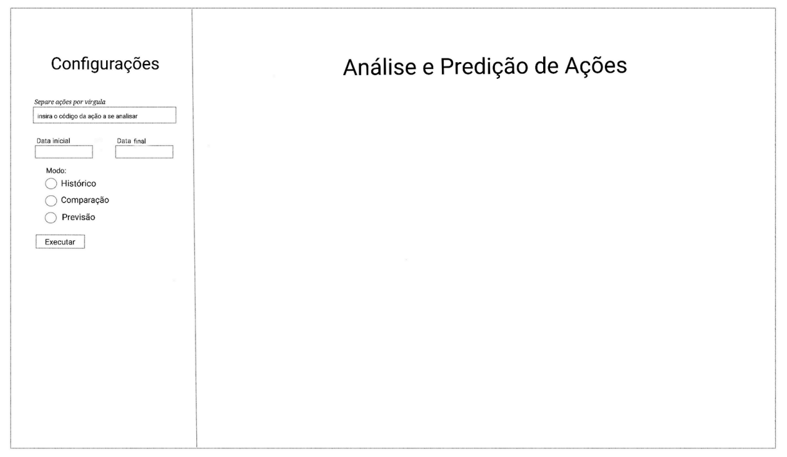
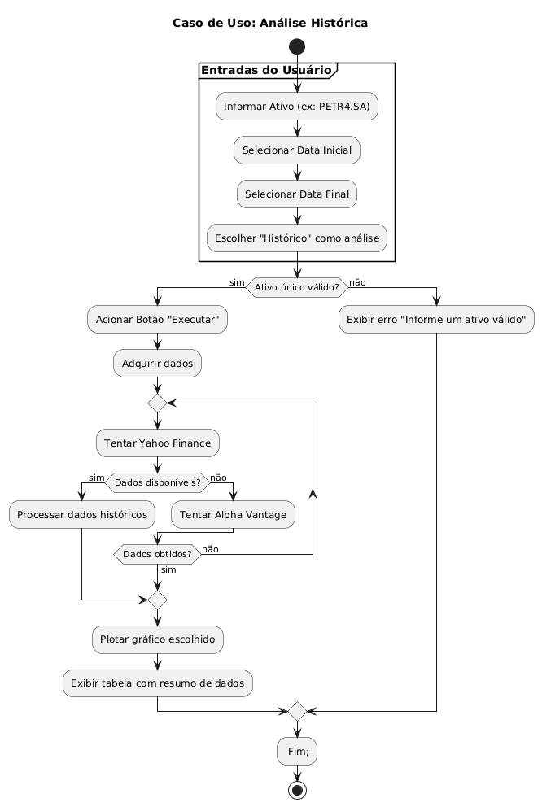
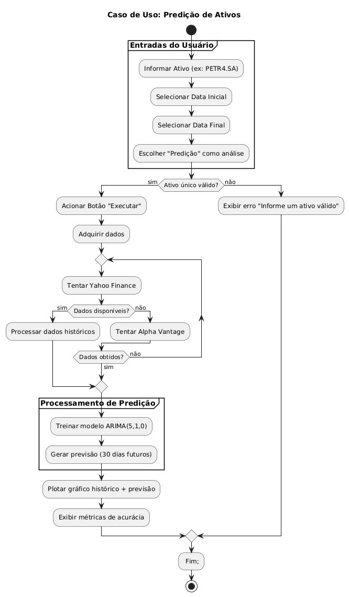
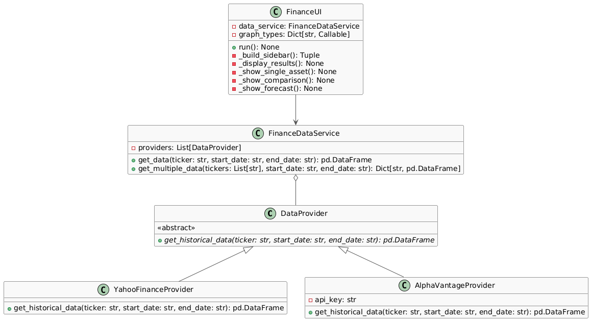

# Dashboard de Análise Financeira

## Descrição do Projeto

Este projeto é um Dashboard de Análise Financeira desenvolvido como trabalho acadêmico para a disciplina de Programação Avançada do curso de Bacharelado em Ciência da Computação. A aplicação permite visualizar e analisar dados históricos de ativos financeiros, com funcionalidades para:

- Visualização de séries temporais em diferentes formatos (linha, candlestick, barras e área)
- Comparação entre múltiplos ativos
- Previsão de tendências usando modelo de Regressão Linear

## Documentações

Antes de iniciar a codar, este projeto teve algumas documentações. Foi levantado casos de uso para compor protótipos, diagrama de atividades, matriz de rastreabilidade contendo 2 requisitos funcionais e, por fim, diagrama de classes.

### Protótipo principal


### Diagrama de Atividade - Análise Histórica


### Diagrama de Atividade - Predição


### Matriz de Rastreabilidade

| Requisito Funcional               | Módulo/Classe                   | Fontes de Dados               | Artefatos Gerados               |
|-----------------------------------|---------------------------------|-------------------------------|----------------------------------|
| **RF01** - Coleta resiliente de dados | `FinanceDataService`           | Yahoo Finance, AlphaVantage   | DataFrame com dados para visualização |
| **RF02** - Visualização de dados      | `FinanceUI`                    | Dados processados             | Gráficos Plotly                  |

### Diagrama de Classes


## Funcionalidades Principais

- ✅ **Múltiplas fontes de dados** 
- ✅ **Visualizações interativas**
- ✅ **Interface intuitiva**
- ✅ **Comparação entre ativos**  
- ✅ **Previsão de séries temporais**  
- ✅ **Responsivo e adaptável**  

## Tecnologias Utilizadas

- Python 3.10+
- Streamlit (interface web)
- Plotly (visualizações interativas)
- yfinance (API Yahoo Finance)
- Alpha Vantage API (fallback)
- Pandas (manipulação de dados)
- Statsmodels (modelo de Regressão Linear para previsão)

## Estrutura do Código

```
FinancialAnalysisDashboard/
├── modules/
│   ├── data_provider.py  # Fontes de dados
│   └── interface.py      # UI e visualizações
├── main.py               # Arquivo para execução
├── requirements.txt      # Dependências do Projeto
└── .env                  # Arquivo com variáveis de ambiente
```

## Como Executar o Projeto

### Pré-requisitos

- Python 3.10 ou superior instalado
- Conta no Alpha Vantage para chave API (opcional)

### Instalação

1. Clone o repositório:
```bash
git clone https://github.com/DomingosFSouza/FinancialAnalysisDashboard.git
cd FinancialAnalysisDashboard
```

2. Crie e ative um ambiente virtual (recomendado):
```bash
python -m venv venv
source venv/bin/activate  # Linux/Mac
venv\Scripts\activate  # Windows
```

3. Instale as dependências:
```bash
pip install -r requirements.txt
```

### Configuração

Crie um arquivo `.env` na raiz do projeto com sua chave Alpha Vantage (opcional, já que se pode fazer 5 requisições por minuto sem uso da ALPHA_VANTAGE_KEY):
```
ALPHA_VANTAGE_KEY=sua_chave_aqui
```

# Configure as variáveis de ambiente
```bash
echo "ALPHA_VANTAGE_KEY=sua_chave" > .env #Linux ou Windows
```

### Execução local

Execute o aplicativo Streamlit:
```bash
streamlit run main.py
```

O aplicativo estará disponível em `http://localhost:8501`

## Disponibilidade Online

Poderá acessar a aplicação de maneira online através do seguinte link:
> https://financialanalysisdashboard.streamlit.app/

## Uso Acadêmico

Este projeto foi desenvolvido como parte dos requisitos para conclusão da disciplina de Programação Avançada. Ele demonstra:

- Princípios de POO (Programação Orientada a Objetos) e Programação Modular
- Padrões de projeto
- Consumo de APIs REST
- Visualização de dados
- Desenvolvimento de interfaces web

## Licença

Este projeto está licenciado sob a Licença MIT - veja o arquivo [LICENSE](LICENSE) para detalhes.

---

- **Aluno:** Domingos Peixoto
- **Instituição:** Universidade Federal do Rio Grande do Norte (UFRN) 
- **Professor:** Hertz Wilton Castro Lins
- **Disciplina:** Programação Avançada (2025.1)

---

> *Nota: Este projeto foi desenvolvido exclusivamente para fins acadêmicos e não deve ser usado para decisões de investimento reais.*
